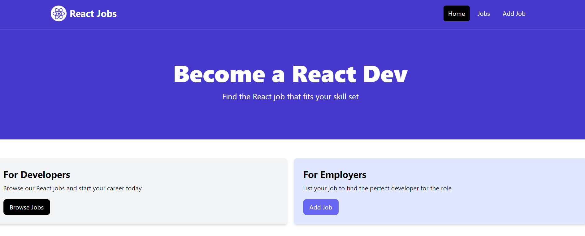
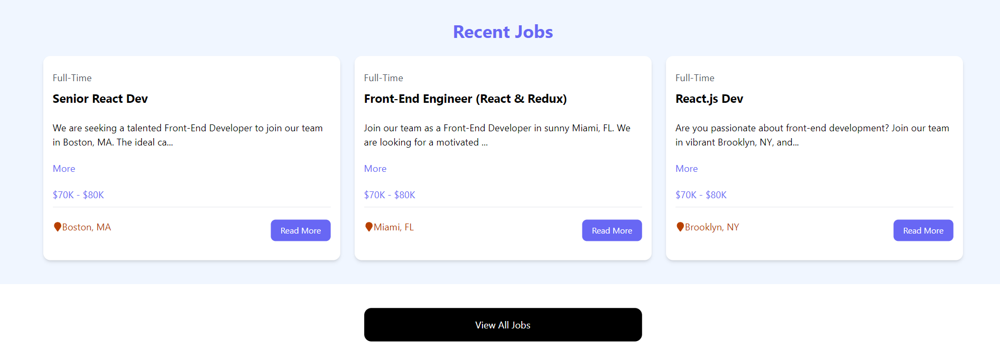
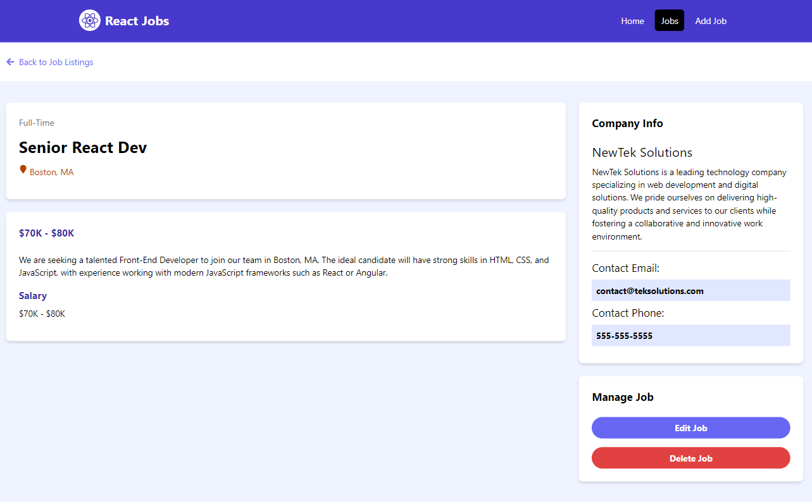

# React-Jobs

A place for businesses to hire react developers and for developers to find jobs.

## Teasers







## Technologies

Built as a Single-Page Application (SPA) where a single HTML file is loaded, then JavaScript loads the entire UI.

The *React* library is used as the front-end, leveraging other libraries like *React-DOM* and *React-Router* to create a full-featured solution.

*Vite* is used as a speedy front-end build toolkit that supports the React framework. It is setup with **Node.js**.

*TailwindCSS* is used to easily style components, leveraging the vast default component styles directly into the JSX.

*json-server* is used to mock the backend of the application, mainly interacting with the jobs.json file with CRUD functionality.

## How to run the project locally

For Development:
```
npm install

npm run dev
```


For Production:
```
npm install

npm build

npm run preview
```

## Resources

The front-end design can be attributed to content creator [bradtraversy](https://github.com/bradtraversy/react-crash-2024/tree/main/_theme_files)